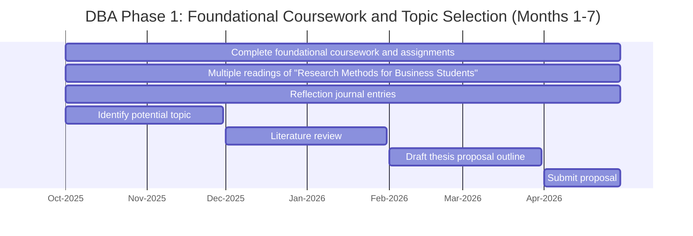

# DBA Phase 1: Foundational Coursework and Topic Selection (Months 1-7)

## Task Details

| Task Number | Task | Start | End |
|-------------|------|-------|-----|
| 1 | Complete foundational coursework and assignments | 2025-10-01 | 2026-04-30 |
| 2 | Multiple readings of "Research Methods for Business Students" | 2025-10-01 | 2026-04-30 |
| 3 | Reflection journal entries | 2025-10-01 | 2026-04-30 |
| 4 | Identify potential topic | 2025-10-01 | 2025-11-30 |
| 5 | Literature review | 2025-12-01 | 2026-01-31 |
| 6 | Draft thesis proposal outline | 2026-02-01 | 2026-03-31 |
| 7 | Submit proposal | 2026-04-01 | 2026-04-30 |

---

**Time Unit:** Monthly  
**Generated:** October 15, 2025  
**Source:** thesis_md/0_reflection_journal/2025/October/thoughts-2-gantt.md
